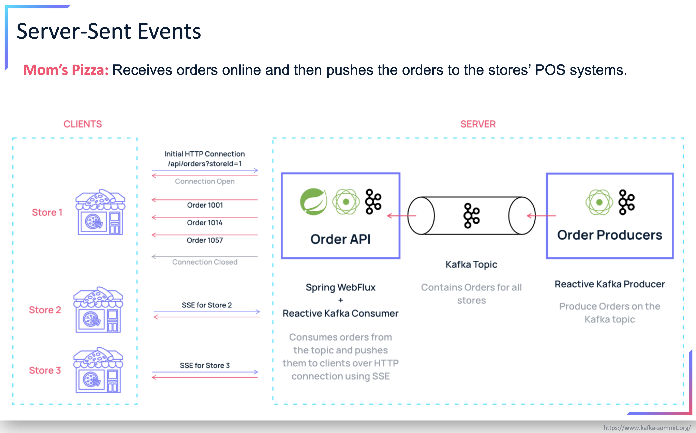

# Kafka Summit Europe 2021 

### Server-Sent-Events using Spring Webflux and Reactive Kafka

WebFlux Server using the Spring WebFlux framework and reactive Kafka which exposes a REST API for the clients to make secure HTTP requests. Once a secure connection is established between the client and the web flux server, it consumes messages from Kafka topics and pushes the data asynchronously without closing connection with the client unless required.

Take a look at the this [medium blog](https://medium.com/egen/server-sent-events-using-spring-webflux-and-reactive-kafka-1a7ddbca4f5d) on SSE using Spring WebFlux using Reactive Kafka.
